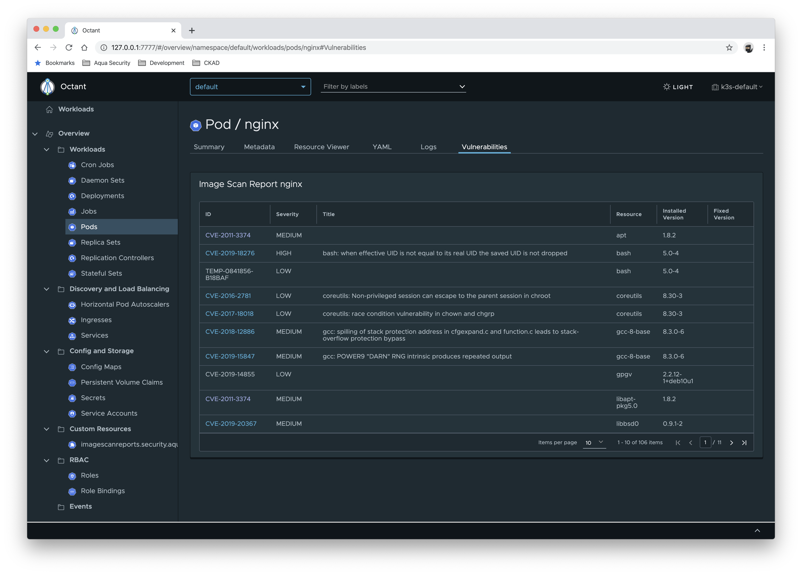
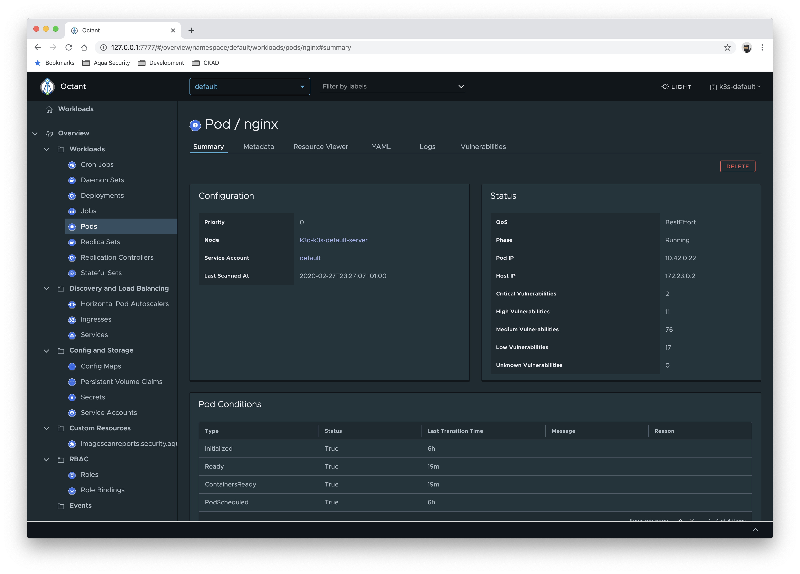

[![GitHub Release][release-img]][release]
[![Build Actions][build-action-img]][build-action]
[![License][license-img]][license]

# Octant Starboard Plugin

This is an [Octant][octant] plugin for [Starboard][starboard] which provides visibility into vulnerability assessment
reports for Kubernetes workloads stored as [custom security resources][k8s-security-crds].

## Install

Octant should first be installed. Run the following command to build and install the plugin:

```
$ make deploy
```

Then, in an environment authenticated against your Kubernetes cluster, run `octant`.

## Screenshots

### List vulnerabilities of unmanaged [Pod][k8s-pod]

This is equivalent of

```
kubectl get vulnerabilities \
  -l starboard.workload.kind=Pod \
  -l starboard.workload.name=nginx \
  -o yaml
```

assuming that `kubectl starboard find vulnerabilities pod/nginx` command was run and the vulnerabilities report saved
as a `vulnerabilities.aquasecurity.github.com` resource.



### Show vulnerabilities summary

Shows the summary of vulnerabilities found in the Pod within the *Status* card.



### List vulnerabilities of [Deployment][k8s-deployment]

This is equivalent of

```
kubectl get vulns
  -l starboard.workload.kind=Deployment \
  -l starboard.workload.name=nginx \
  -o yaml
```

assuming that `kubectl starboard find vulns deployments/nginx` command was run and the vulnerabilities report saved
as a `vulnerabilities.aquasecurity.github.com` resource.


## Uninstall

Run the following command to remove the plugin:

```
rm -f ~/.config/octant/plugins/octant-starboard-plugin
```

## License

This repository is available under the [Apache License 2.0][license].

[release-img]: https://img.shields.io/github/release/aquasecurity/octant-starboard-plugin.svg
[release]: https://github.com/aquasecurity/octant-starboard-plugin/releases
[build-action-img]: https://github.com/aquasecurity/octant-starboard-plugin/workflows/build/badge.svg
[build-action]: https://github.com/aquasecurity/octant-starboard-plugin/actions
[license-img]: https://img.shields.io/github/license/aquasecurity/octant-starboard-plugin.svg
[license]: https://github.com/aquasecurity/octant-starboard-plugin/blob/master/LICENSE
[octant]: https://octant.dev/
[starboard]: https://github.com/aquasecurity/starboard
[trivy]: https://github.com/aquasecurity/trivy
[k8s-security-crds]: https://github.com/aquasecurity/k8s-security-crds
[k8s-pod]: https://kubernetes.io/docs/concepts/workloads/pods/pod/
[k8s-deployment]: https://kubernetes.io/docs/concepts/workloads/controllers/deployment/
