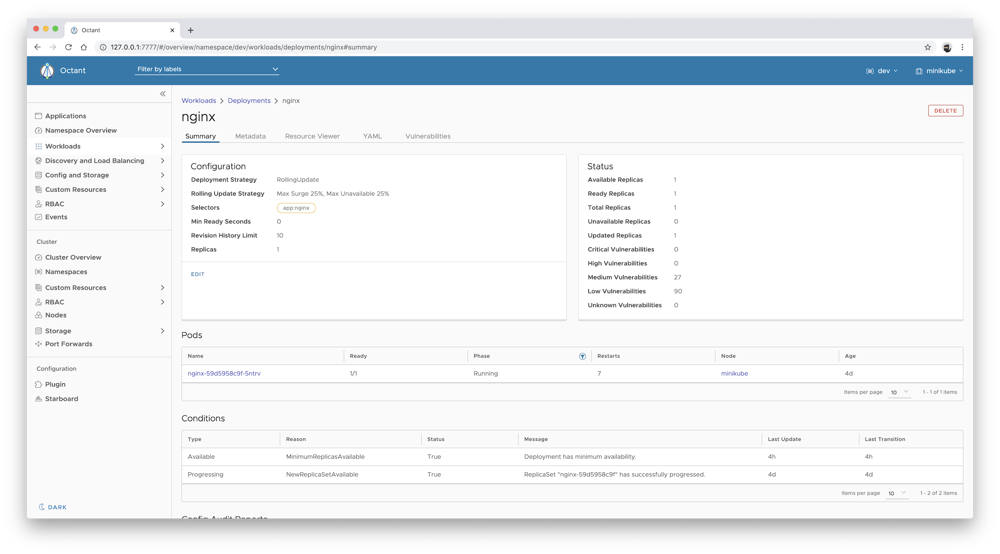

# Starboard Octant Plugin

[![GitHub Release][release-img]][release]
[![GitHub Build Actions][build-action-img]][actions]
[![GitHub Release Action][release-action-img]][actions]
[![License][license-img]][license]
[![GitHub All Releases][github-all-releases-img]][release]

> This is an [Octant][octant] plugin for [Starboard][starboard] which provides visibility into vulnerability assessment
> reports for Kubernetes workloads stored as [custom security resources][starboard-crds].


## Table of Contents

- [Installing](#installing)
  - [Prerequisites](#prerequisites)
  - [From the Binary Releases](#from-the-binary-releases)
  - [From Source (Linux, macOS)](#from-source-linux-macos)
- [Getting Started](#getting-started)
- [Use Cases](#use-cases)
  - [Displaying Vulnerabilities Summary](#displaying-vulnerabilities-summary)
  - [Displaying Kubernetes Configuration Audit Reports](#displaying-kubernetes-configuration-audit-reports)
  - [Displaying CIS Kubernetes Benchmark Reports](#displaying-cis-kubernetes-benchmark-reports)
  - [Displaying kube-hunter Reports](#displaying-kube-hunter-reports)
- [Uninstalling](#uninstalling)
- [License](#license)

## Installing

This guide shows how to install the Starboard Octant plugin. The plugin can be installed either from source, or from
pre-built binary releases.

### Prerequisites

- Octant >= 0.13 should first be installed. On macOS this is as simple as `brew install octant`. For installation
  instructions on other operating systems and package managers, see [Octant Installation][octant-installation].
- Environment authenticated against your Kubernetes cluster

> In the following instructions we assume that the `$HOME/.config/octant/plugins` directory is the default plugins
> location respected by Octant. Note that the default location might be changed by setting the `OCTANT_PLUGIN_PATH`
> environment variable when running Octant.

### From the Binary Releases

Every [release][release] of Starboard Octant plugin provides binary releases for a variety of operating systems. These
binary versions can be manually downloaded and installed.

1. Download your [desired version][release]
2. Unpack it (`tar -zxvf starboard-octant-plugin_darwin_x86_64.tar`)
3. Find the `starboard-octant-plugin` binary in the unpacked directory, and move it to the default Octant's
   configuration directory (`mv starboard-octant-plugin_darwin_x86_64/starboard-octant-plugin $HOME/.config/octant/plugins`).
   You might need to create the directory if it doesn't exist already.

### From Source (Linux, macOS)

Building from source is slightly more work, but is the best way to go if you want to test the latest (pre-release)
version of the plugin.

You must have a working Go environment.

```
$ git clone git@github.com:aquasecurity/starboard-octant-plugin.git
$ cd starboard-octant-plugin
$ make install
```

The `make install` goal copies the plugin binary to the `$HOME/.config/octant/plugins` directory.

## Getting Started

As an example let's run an old version of `nginx` that we know has vulnerabilities. Create an `nginx` Deployment in the
`dev` namespace:

```
$ kubectl create deployment nginx --image nginx:1.16 --namespace dev
```

Run the scanner to find the vulnerabilities:

```
$ starboard find vulnerabilities deploy/nginx --namespace dev
```

> In the example above we are using the Starboard CLI to populate the vulnerability information. However, another option
> might be the [operator][starboard-operator] which populates the Starboard CRDs. No matter how the CRDs are created,
> they are visible within Octant.

You can now display the vulnerabilities reports in the Octant interface by following these steps:

1. Run `octant` and select the `dev` namespace.
2. Expand **Workloads** and select **Deployments**.
3. Click the `nginx` link to display the Deployment's details.
4. Select the **Vulnerabilities** tab to access the vulnerabilities report.

   

   The data displayed in the **Vulnerabilities** tab is equivalent of getting the `vulnerabilities.aquasecurity.github.io`
   resources for the `nginx` Deployment:

   ```
   $ starboard get vulnerabilities deploy/nginx --namespace dev --output yaml
   ```

   or

   ```
   $ kubectl get vulnerabilityreports.aquasecurity.github.io \
     --selector starboard.resource.kind=Deployment,starboard.resource.name=nginx \
     --namespace dev \
     --output yaml
   ```

Similar to displaying vulnerability reports for the specified Deployment, Starboard Octant plugin allows you to display
vulnerability reports for every Kubernetes workload, such as Cron Jobs, Daemon Sets, Jobs, unmanaged Pods, Replica Sets,
Replication Controllers, and Stateful Sets.

To learn more about features provided by the Starboard Octant plugin, please review other [use cases](#use-cases).

## Use Cases

### Displaying Vulnerabilities Summary

To display the summary of vulnerabilities for the specified workload:

1. Expand **Workloads** and select desired workload.
2. Click the link with the workload's name to display the details.

   

   The **Status** card component shows the summary of vulnerabilities in the container images of the selected workload.

### Displaying Kubernetes Configuration Audit Reports

To display a configuration audit report for the specified workload, which is represented as an instance of the
`configauditreports.aquasecurity.github.io` resource:

1. Expand **Workloads** and select desired workload.
2. Click the link with the workload's name to display the details.

   

   The report is shown under the **Config Audit Report** heading.

### Displaying CIS Kubernetes Benchmark Reports

CIS Kubernetes Benchmarks reports are represented by `ciskubebenchreports.aquasecurity.github.io` resources, which
are associated with [Nodes][k8s-node]. To display the latest report for the specified Node:

1. Expand **Nodes**.
2. Click the link with the Node's name to display the details.
3. Select the **CIS Kubernetes Benchmark** tab to access the latest Kubernetes Benchmark report for that Node.

   

   The report displayed in the **CIS Kubernetes Benchmark** tab is equivalent of getting the `ciskubebenchreports`
   resource for a given Node:

   ```
   $ kubectl get ciskubebenchreports.aquasecurity.github.io \
     --selector starboard.resource.kind=Node,starboard.resource.name=minikube \
     --output yaml
   ```

## Displaying kube-hunter Reports

Reports generated by kube-hunter are represented by `kubehunterreports.aquasecurity.github.io` resources. To display
the latest kube-hunter report:

1. Expand **Starboard**.

   

   The report displayed in the **Starboard** pane is equivalent of getting the `kubehunterreports` resource:
   
   ```
   $ kubectl get kubehunterreports.aquasecurity.github.io \
     --selector starboard.resource.kind=Cluster,starboard.resource.name=cluster \
     --output yaml
   ```

## Uninstalling

Run the following command to remove the plugin:

```
rm -f $OCTANT_PLUGIN_PATH/starboard-octant-plugin
```

where `$OCTANT_PLUGIN_PATH` is the default plugins location respected by Octant. If not set, it defaults to the
`$HOME/.config/octant/plugins` directory.

## License

This repository is available under the [Apache License 2.0][license].

[release-img]: https://img.shields.io/github/release/aquasecurity/starboard-octant-plugin.svg?logo=github
[release]: https://github.com/aquasecurity/starboard-octant-plugin/releases
[build-action-img]: https://github.com/aquasecurity/starboard-octant-plugin/workflows/build/badge.svg
[release-action-img]: https://github.com/aquasecurity/starboard-octant-plugin/workflows/release/badge.svg
[actions]: https://github.com/aquasecurity/starboard-octant-plugin/actions
[license-img]: https://img.shields.io/github/license/aquasecurity/starboard-octant-plugin.svg
[license]: https://github.com/aquasecurity/starboard-octant-plugin/blob/main/LICENSE
[github-all-releases-img]: https://img.shields.io/github/downloads/aquasecurity/starboard-octant-plugin/total?logo=github

[octant]: https://octant.dev/
[octant-installation]: https://github.com/vmware-tanzu/octant#installation

[starboard]: https://github.com/aquasecurity/starboard
[starboard-crds]: https://github.com/aquasecurity/starboard#custom-security-resources-definitions
[starboard-cli]: https://github.com/aquasecurity/starboard#starboard-cli
[starboard-operator]: https://github.com/aquasecurity/starboard-operator

[k8s-node]: https://kubernetes.io/docs/concepts/architecture/nodes/
