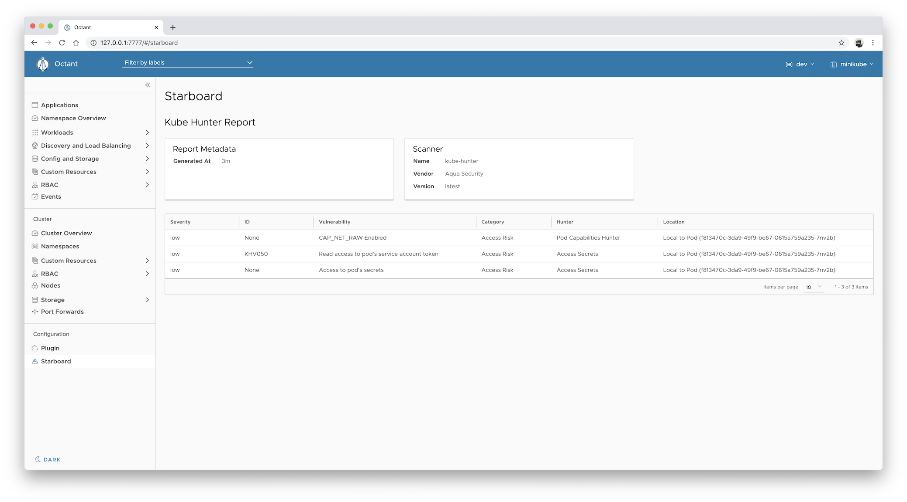

# Octant Starboard Plugin

[![GitHub Release][release-img]][release]
[![Build Actions][build-action-img]][build-action]
[![License][license-img]][license]

> This is an [Octant][octant] plugin for [Starboard][starboard] which provides visibility into vulnerability assessment
> reports for Kubernetes workloads stored as [custom security resources][starboard-crds].

## Table of Contents

- [Installing](#installing)
  - [Prerequisites](#prerequisites)
  - [From the Binary Releases](#from-the-binary-releases)
  - [From Source (Linux, macOS)](#from-source-linux-macos)
- [Getting Started](#getting-started)
- [Use Cases](#use-cases)
  - [Displaying Vulnerabilities Summary](#displaying-vulnerabilities-summary)
  - [Displaying Kubernetes Configuration Audit Reports](#displaying-kubernetes-configuration-audit-reports)
  - [Displaying CIS Kubernetes Benchmark Reports](#displaying-cis-kubernetes-benchmark-reports)
  - [Displaying kube-hunter Reports](#displaying-kube-hunter-reports)
- [Uninstalling](#uninstalling)
- [License](#license)

## Installing

This guide shows how to install the Octant Starboard plugin. The plugin can be installed either from source, or from
pre-built binary releases.

### Prerequisites

- Octant should first be installed
- Environment authenticated against your Kubernetes cluster

> In the following instructions we assume that the `$HOME/.config/octant/plugins` directory is the default plugins
> location respected by Octant. Note that the default location might be changed by setting the `OCTANT_PLUGIN_PATH`
> environment variable when running Octant.

### From the Binary Releases

Every [release][release] of Octant Starboard plugin provides binary releases for a variety of operating systems. These
binary versions can be manually downloaded and installed.

1. Download your [desired version][release]
2. Unpack it (`tar -zxvf octant-starboard-plugin_darwin_x86_64.tar`)
3. Find the `octant-starboard-plugin` binary in the unpacked directory, and move it to the default Octant's
   configuration directory (`mv octant-starboard-plugin_darwin_x86_64/octant-starboard-plugin $HOME/.config/octant/plugins`)

### From Source (Linux, macOS)

Building from source is slightly more work, but is the best way to go if you want to test the latest (pre-release)
version of the plugin.

You must have a working Go environment.

```
$ git clone git clone git@github.com:aquasecurity/octant-starboard-plugin.git
$ cd octant-starboard-plugin
$ export GOPRIVATE=github.com/aquasecurity/starboard
$ make deploy
```

The `make deploy` goal copies the plugin binary to the `$HOME/.config/octant/plugins` directory.

## Getting Started

If there's the `nginx` Deployment in the `dev` namespace:

```
$ kubectl create deployment nginx --image=nginx:1.16 --namespace=dev
```

And you have already run the scanner to find its containers' images vulnerabilities. For example, with Starboard CLI
or `kubectl starboard` plugin, you could have run the following command:

```
$ kubectl starboard find vulnerabilities -n dev deploy/nginx --namespace=dev
```

You can now display the vulnerabilities reports in the Octant interface by following these steps:

1. Run `octant` and select the `dev` namespace.
2. Expand **Workloads** and select **Deployments**.
3. Click the `nginx` link to display the Deployment's details.
4. Select the **Vulnerabilities** tab to access the vulnerabilities report.

   

   The data displayed in the **Vulnerabilities** tab is equivalent of getting the `vulnerabilities.aquasecurity.github.io`
   resources for the `nginx` Deployment:

   ```
   $ kubectl get vulnerabilities.aquasecurity.github.io \
     -l starboard.resource.kind=Deployment,starboard.resource.name=nginx \
     -o yaml
   ```

Similary to displaying vulnerability reports for the specified Deployment, Starboard Octant plugin allows you to display
vulnerability reports for every Kubernetes workload, such as Cron Jobs, Daemon Sets, Jobs, unmanaged Pods, Replica Sets,
Replication Controllers, and Stateful Sets.

To learn more about features provided by the Starboard Octant plugin, please review other [use cases](#use-cases).

## Use Cases

### Displaying Vulnerabilities Summary

To display the summary of vulnerabilities for the specified workload:

1. Expand **Workloads** and select desired workload.
2. Click the link with the workload's name to display the details.

   

   The **Status** card component shows the summary of vulnerabilities in the container images of the selected workload.

### Displaying Kubernetes Configuration Audit Reports

> TODO: Explain how to display `configauditrepots.aquasecurity.github.io` resources.

### Displaying CIS Kubernetes Benchmark Reports

CIS Kubernetes Benchmarks reports are represented by `ciskubebenchreports.aquasecurity.github.io` resources, which
are associated with [Nodes][k8s-node]. To display the latest report for the specified Node:

1. Expand **Nodes**.
2. Click the link with the Node's name to display the details.
3. Select the **CIS Kubernetes Benchmark** tab to access the latest Kubernetes Benchmark report for that Node.

   

   The report displayed in the **CIS Kubernetes Benchmark** tab is equivalent of getting the `ciskubebenchreports`
   resource for a given Node:

   ```
   $ kubectl get ciskubebenchreports.aquasecurity.github.io \
     -l starboard.history.latest=true,starboard.resource.kind=Node,starboard.resource.name=minikube \
     -o yaml
   ```

## Displaying kube-hunter Reports

Reports generated by kube-hunter are represented by `kubehunterreports.aquasecurito.github.io` resources. To display
the latest kube-hunter report:

1. Expand **Starboard**.

   

   The report displayed in the **Starboard** pane is equivalent of getting the `kubehunterreports` resource:
   
   ```
   $ kubectl get kubehuner.aquasecurity.github.io \
     -l starboard.resource.kind=Cluster,starboard.resource.name=cluster \
     -o yaml
   ```

## Uninstalling

Run the following command to remove the plugin:

```
rm -f $OCTANT_PLUGIN_PATH/octant-starboard-plugin
```

where `$OCTANT_PLUGIN_PATH` is the default plugins location respected by Octant. If not set, it defaults to the
`$HOME/.config/octant/plugins` directory.

## License

This repository is available under the [Apache License 2.0][license].

[release-img]: https://img.shields.io/github/release/aquasecurity/octant-starboard-plugin.svg
[release]: https://github.com/aquasecurity/octant-starboard-plugin/releases
[build-action-img]: https://github.com/aquasecurity/octant-starboard-plugin/workflows/build/badge.svg
[build-action]: https://github.com/aquasecurity/octant-starboard-plugin/actions
[license-img]: https://img.shields.io/github/license/aquasecurity/octant-starboard-plugin.svg
[license]: https://github.com/aquasecurity/octant-starboard-plugin/blob/master/LICENSE
[octant]: https://octant.dev/
[starboard]: https://github.com/aquasecurity/starboard
[trivy]: https://github.com/aquasecurity/trivy
[starboard-crds]: https://github.com/aquasecurity/starboard#custom-security-resources-definitions
[k8s-pod]: https://kubernetes.io/docs/concepts/workloads/pods/pod/
[k8s-deployment]: https://kubernetes.io/docs/concepts/workloads/controllers/deployment/
[k8s-node]: https://kubernetes.io/docs/concepts/architecture/nodes/
