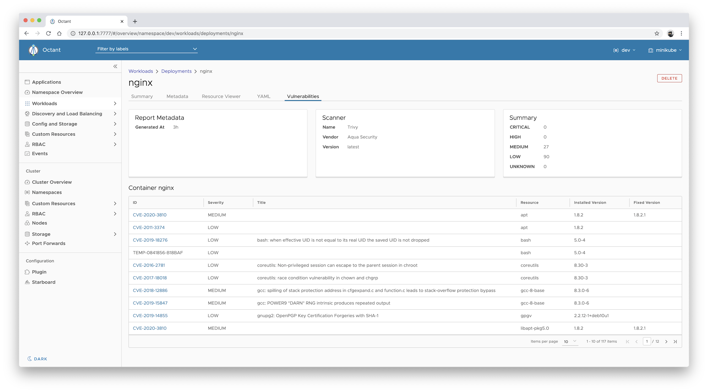

[![GitHub Release][release-img]][release]
[![Build Actions][build-action-img]][build-action]
[![License][license-img]][license]

# Octant Risky Plugin

This is an [Octant][octant] plugin for [kubectl risky][kubectl-risky] which provides visibility into
vulnerabilities of Kubernetes workloads discovered by [Trivy][trivy] scanner.

## Install

Octant should first be installed. Run the following command to build and install the plugin:

```
$ make deploy
```

Then, in an environment authenticated against your Kubernetes cluster, run `octant`.

## Screenshots

### List vulnerabilities of unmanaged [Pod][k8s-pod]

This is equivalent of `kubectl get vulnerabilities -l risky.workload.kind=Pod -l risky.workload.name=nginx -o yaml`,
assuming that `kubectl risky scan pod/nginx` was run and saved a scan report as an instance of
the `vulnerabilities.aquasecurity.github.com` [custom resource][k8s-custom-resources].


### Show vulnerabilities summary

Shows the summary of vulnerabilities found in the Pod within the **Status** card.


### List vulnerabilities of [Deployment][k8s-deployment]

This is equivalent of `kubectl get vulnerabilities -l risky.workload.kind=Deployment -l risky.workload.name=nginx -o yaml`,
assuming that `kubectl risky scan deployments/nginx` was run and saved a scan report as an instance of
the `vulnerabilities.aquasecurity.github.com` [custom resource][k8s-custom-resources].



## Uninstall

Run the following command to remove the plugin:

```
rm -f ~/.config/octant/plugins/octant-risky-plugin
```

[release-img]: https://img.shields.io/github/release/aquasecurity/octant-risky-plugin.svg
[release]: https://github.com/aquasecurity/octant-risky-plugin/releases
[build-action-img]: https://github.com/aquasecurity/octant-risky-plugin/workflows/build/badge.svg
[build-action]: https://github.com/aquasecurity/octant-risky-plugin/actions
[license-img]: https://img.shields.io/github/license/aquasecurity/octant-risky-plugin.svg
[license]: https://github.com/aquasecurity/octant-risky-plugin/blob/master/LICENSE
[octant]: https://octant.dev/
[kubectl-risky]: https://github.com/aquasecurity/kubectl-risky
[trivy]: https://github.com/aquasecurity/trivy
[k8s-custom-resources]: https://kubernetes.io/docs/concepts/extend-kubernetes/api-extension/custom-resources/
[k8s-pod]: https://kubernetes.io/docs/concepts/workloads/pods/pod/
[k8s-deployment]: https://kubernetes.io/docs/concepts/workloads/controllers/deployment/
